# 眼底医学图像处理平台

# 注意

由于github大文件的限制，目录里缺少了一个权重参数的文件LSRGAN_x2.pth.tar，可以通过以下链接下载，下载以后放在main.py同级目录即可

链接：https://pan.baidu.com/s/1TIrhnCHpkXmGDysFl0TopQ 
提取码：evhi 
--来自百度网盘超级会员V5的分享

## 小组成员
- 李振凯10225101541
- 陈喆10225101542

## github仓库地址

[Iridescentttttt/Fundus-image-processing-platform (github.com)](https://github.com/Iridescentttttt/Fundus-image-processing-platform)

## 项目主题
眼底视网膜医学图像是检测疾病很重要的依据，但是由于各种原因（如仪器的限制、天然的噪声、患者的配合度）眼底医学图像在成像时面临着许许多多的问题，包括噪声、分辨率过低等等。我们小组以眼底医学图像为背景，制作了一个眼底医学图像处理的平台，该平台有着去噪、血管检测、超分辨率等多种功能，每种功能有不同的实现方法，用户可以根据自己的需要选择结果最好的一种方法对原图像进行处理。

## 眼底图像example


## 运行方法
直接运行main.py
(或者命令行输入"python main.py")

## 功能简介

- Open Image:打开文件
- Save Image:保存文件
- Reset:重置图像
- Enhance:图像增强
    - 输入'A':亮度增强
    - 输入'B':直方图均衡化
- Add Noise:添加噪声
    - 输入'A':高斯噪声
    - 输入'B':椒盐噪声
- Edge Detection:边缘检测
    - 输入'A':Sobel算子边缘检测
    - 输入'B':Robert算子边缘检测
    - 输入'C':Laplacian算子边缘检测
- Noise Reduction:去噪
    - Mean Filter:均值滤波器
    - Median Filter:中指滤波器
    - Bilateral Filter:双边滤波器
- Super Resolution:图像超分辨率
    - Bicubic:Bicubic Interpolation双三次插值方法
    - SRCNN:Super-Resolution Convolutional Neural Network卷积神经网路方法
    - LSRGAN:Lightweight Super-Resolution Generative Adversarial Network生成对抗网络
- Detect Blood Vessels:眼底血管检测(匹配滤波方法)

## 界面说明
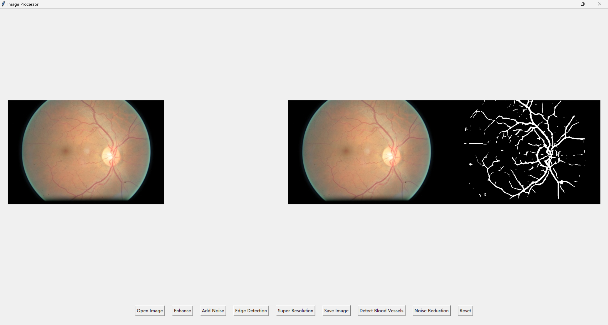
上方是图片展示区，左边为通过open Image方法打开的原图，右边为经过各种处理（下方按钮点击）后的结果图
下方的各个按钮的功能如上面的功能简介所示

## 超分方法结果对比

原图：

bicubic
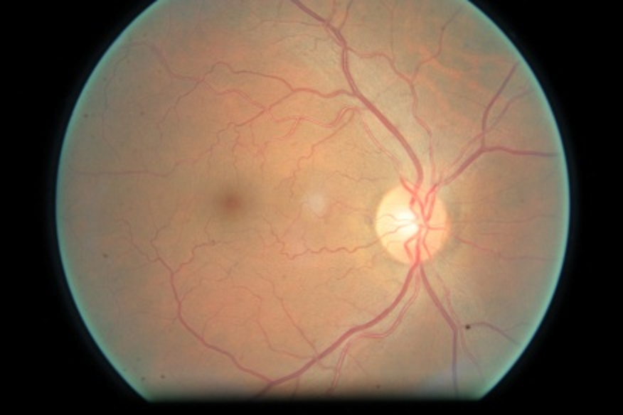
SRCNN

LSRGAN
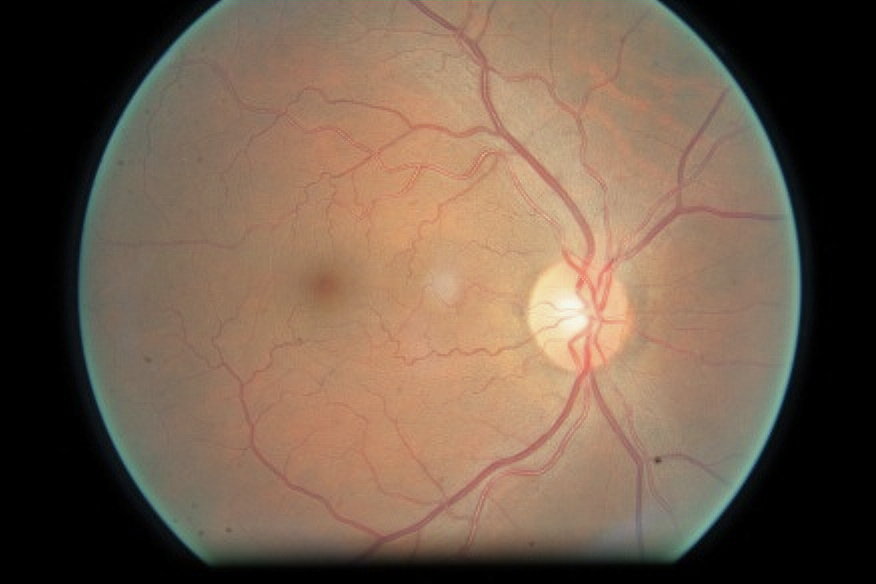

## 项目文件说明
1. main.py:运行入口，所有功能集成在该文件中，运行该项目直接运行该文件即可
2. SRCNN.py:卷积神经网络调用代码
3. model_SRCNN.py:卷积神经网络实现图像超分辨率的模型代码
4. SRCNN_x2.pth:卷积神经网络模型参数（上采样2倍）
5. LSRGAN.py:轻量级生成对抗网络调用代码
6. lsrgan_config.py:轻量级生成对抗网络超参数配置代码文件 
7. model_LSRGAN.py:轻量级生成对抗网络实现图像超分辨率的模型代码 
8. LSRGAN_x2.pth.tar:轻量级生成对抗网络模型参数（上采样2倍） 
9. restinal.py:眼底图像血管检测代码（匹配滤波方法） 
10. utils.py:图像处理的工具函数
11. metrics.py:比较不同超分方法的PSNR和SSIM指标

## 超分辨率深度学习模型训练过程
因为现有的模型都是用的Set5等常见数据集训练的，所以我们小组针对眼底图像场景专门使用眼底数据集训练了眼底图像超分辨率深度学习模型，并且评测了其指标（PSNR和SSIM）

### 数据集
https://www.kaggle.com/competitions/diabetic-retinopathy-detection/data?select=train.zip.004

训练数据集：400张眼底图像

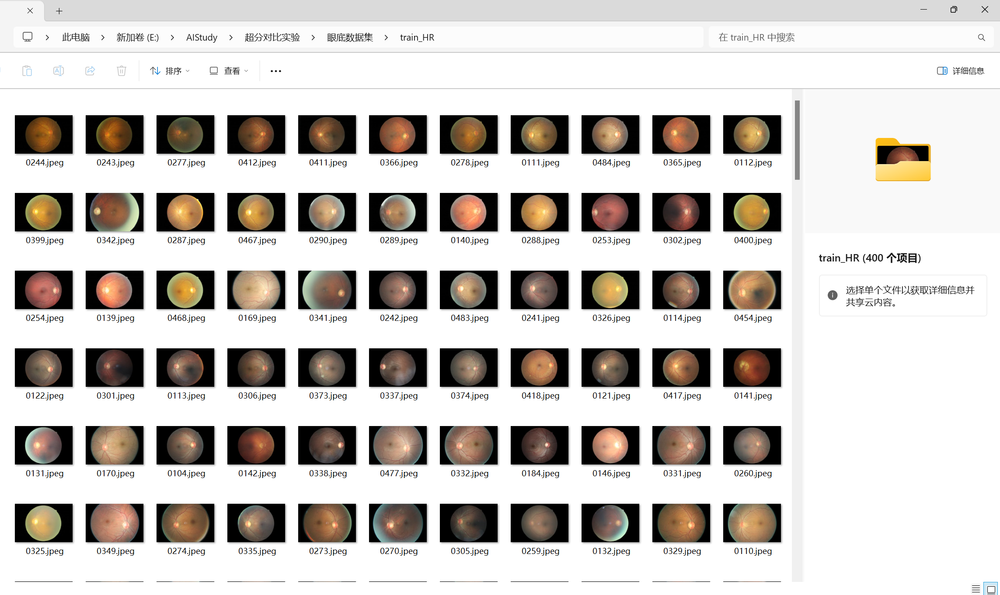

验证数据集
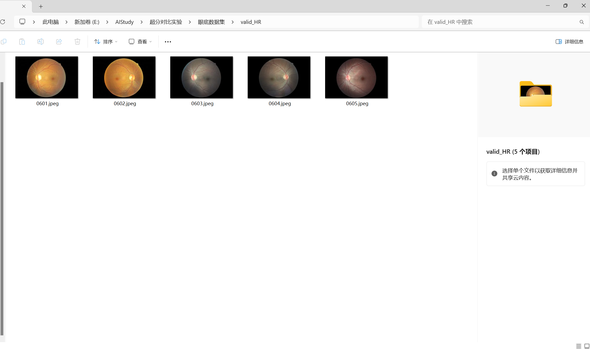

测试数据集
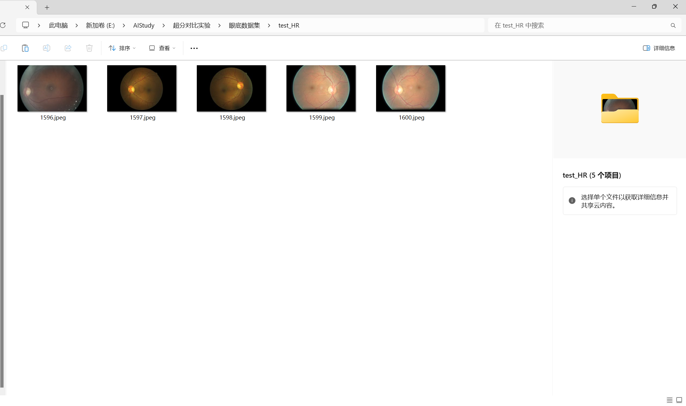

### SRCNN
```text
Epoch 0. Training loss: 0.14875313472002744  Average PSNR: 13.378548447840299 dB.
Epoch 1. Training loss: 0.015275207967497408  Average PSNR: 17.42924177677117 dB.
Epoch 2. Training loss: 0.011266281926073134  Average PSNR: 18.757091258443367 dB.
Epoch 3. Training loss: 0.007268386427313089  Average PSNR: 21.45991297849006 dB.
Epoch 4. Training loss: 0.003995528084924444  Average PSNR: 23.848708920906056 dB.
......训练过程记录详见train/SRCNN_train_course.txt
```

### LSRGAN
```text
Epoch: [1][   1/2490]   Time  1.903 ( 1.903)    Data  0.000 ( 0.000)    Pixel loss 0.002160 (0.002160)     Content loss 0.678612 (0.678612)        Adversarial loss 0.000120 (0.000120)       D(HR)  0.701 ( 0.701)   D(SR)  0.053 ( 0.053)
Epoch: [1][ 101/2490]   Time  0.185 ( 0.213)    Data  0.000 ( 0.000)    Pixel loss 0.002645 (0.002387)     Content loss 0.754395 (0.665500)        Adversarial loss 0.000000 (0.000002)       D(HR)  0.987 ( 0.959)   D(SR)  0.001 ( 0.001)
Epoch: [1][ 201/2490]   Time  0.183 ( 0.202)    Data  0.000 ( 0.000)    Pixel loss 0.002106 (0.002390)  Content loss 0.447822 (0.650160)        Adversarial loss 0.000000 (0.000001)    D(HR)  0.986 ( 0.973) D(SR)  0.000 ( 0.001)
Epoch: [1][ 301/2490]   Time  0.190 ( 0.198)    Data  0.000 ( 0.000)    Pixel loss 0.002433 (0.002364)  Content loss 0.642693 (0.633512)        Adversarial loss 0.000000 (0.000001)    D(HR)  0.994 ( 0.979) D(SR)  0.000 ( 0.001)
......训练过程记录详见train/LSRGAN_train_course.txt
```

### 指标对比
Bicubic:
PSNR (Y channel): 44.14 dB
SSIM (Y channel): 0.9719

SRCNN:
PSNR (Y channel): 39.65 dB
SSIM (Y channel): 0.9574

LSRGAN:
PSNR (Y channel): 31.65 dB
SSIM (Y channel): 0.9586

### 细节对比
原图：

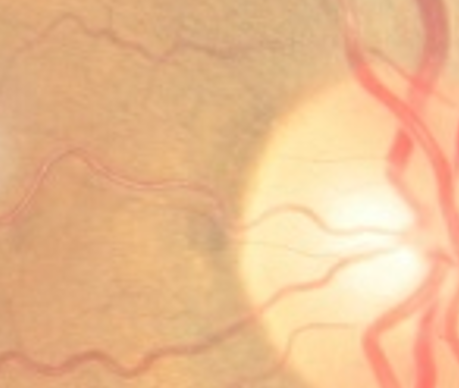

低分辨率：

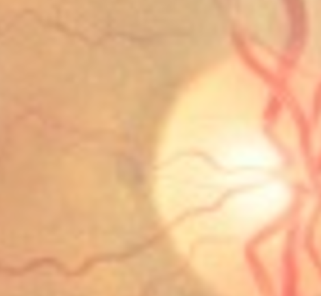

Bicubic:

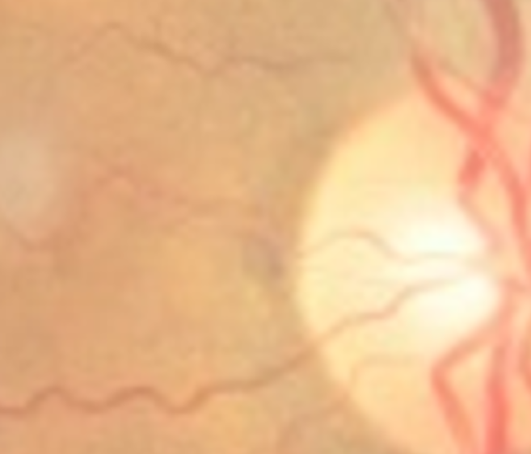

SRCNN:

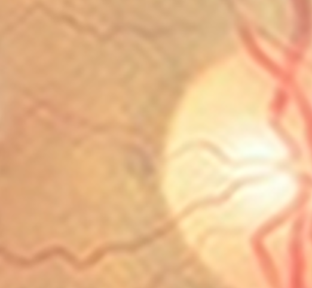

LSRGAN:

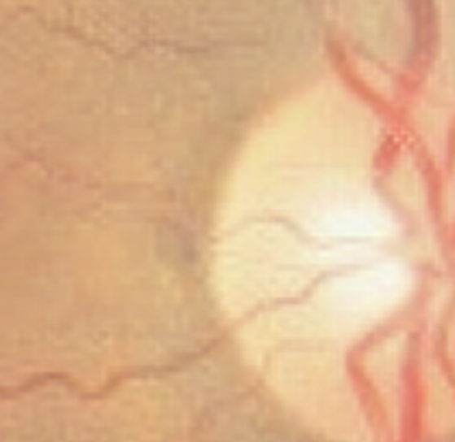
